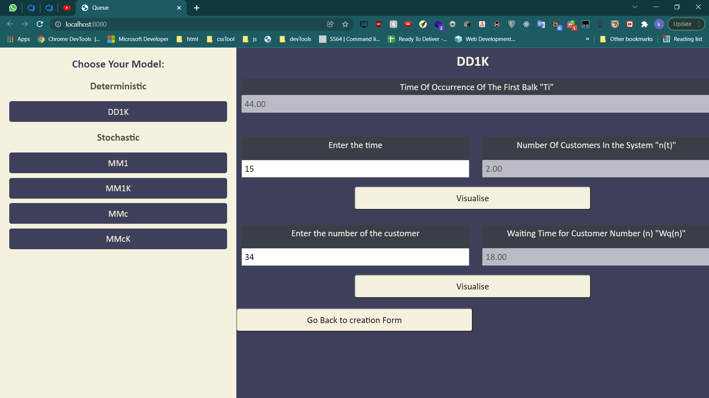

<h3 align="center">Whats Up with My Queue</h3>

This project calculate different performance matrices for multiple queuing models.
 
<a href="https://algograph.github.io/Queuing-theory/">View Demo</a>
·
<a href="https://github.com/AlgoGraph/Queuing-theory/issues">Report Bug</a>
·
<a href="https://github.com/AlgoGraph/Queuing-theory/issues">Request Feature</a>

---
## Objective
### This project calculate performance matrices, and visualization for the system behaviour over time for the queuing models:
- #### DD1K
- #### MM1
- #### MM1K
- #### MMC
- #### MMcK

## [Live site](https://algograph.github.io/Queuing-theory/)

---
## Live Screenshots 

  
Live Screenshots

    <ol>
        <li>
            
        </li>
        <li>
            
        </li>
        <li>
            
        </li>
        <li>
            
        </li>
        <li>
            
        </li>
    </ol>

[comment]: <> (refrence links)
[linkedin-shield]: https://img.shields.io/badge/-LinkedIn-black.svg?style=for-the-badge&logo=linkedin&colorB=066
[linkedin-url-e]: https://linkedin.com/in/ahmedeid12
[linkedin-url-m]: https://linkedin.com/in/eng-ahmedmagdy

---
### Contributors

#### Ahmed Magdy
[![LinkedIn][linkedin-shield]][linkedin-url-m]
----

#### Ahmed Eid
[![LinkedIn][linkedin-shield]][linkedin-url-e]

----
